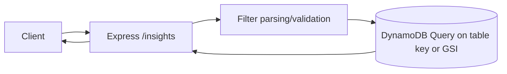
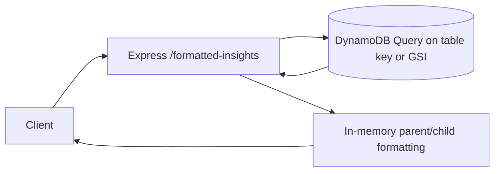
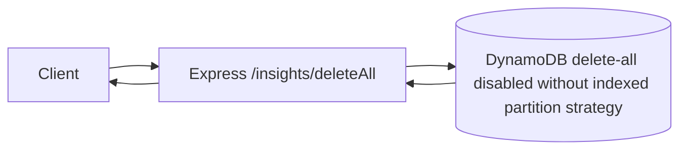
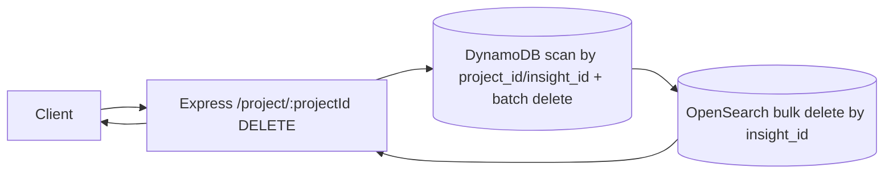
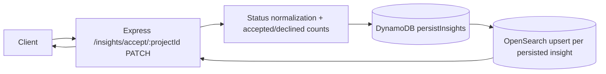
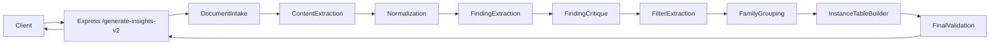

# Aetio Backend (TypeScript)

## Run locally

```bash
npm install
npm run dev
```

To run with local AWS profile:

```bash
AWS_PROFILE=amplify-policy-348665872628 AWS_REGION=us-east-2 npm run dev
```

## Build + run

```bash
npm run build
npm start
```

## Integration test

```bash
npm run test:v2
```

Environment variables often used in tests/scripts:

- `AETIO_BACKEND_URL`
- `GENERATE_INSIGHTS_V2_TEST_OUTPUT_URIS`
- `GENERATE_INSIGHTS_V2_TEST_CONTEXT_URIS`
- `GENERATE_INSIGHTS_V2_TEST_RESEARCH_CONTEXT`

## API Overview

Base URL (local): `http://localhost:8000`

Public endpoints:

- `GET /health`
- `GET /insights`
- `GET /formatted-insights`
- `DELETE /insights/deleteAll`
- `DELETE /project/:projectId`
- `PATCH /insights/accept/:projectId`
- `POST /generate-insights-v2`

Note: Insight detail endpoints (`GET /insight/:insightId`, `GET /insight/tree/:insightId`) are served by `aetio-search`.

---

## `GET /health`

Description: Lightweight liveness check.

Input:

- Path params: none
- Query params: none
- Body: none

Output:

- `200 text/plain`: `ok`

System diagram:


---

## `GET /insights`

Description: Lists insights from DynamoDB with optional filters.

Input:

- Path params: none
- Query params (supported only):
  - `insight_id`
  - `project_id`
  - `parent_insight_id`
  - `text`
  - `user_id`
  - `status`
  - `s3_node`
  - `document_id`
- Query value behavior:
  - `key=value` exact match
  - `key=a,b,c` OR match among values
  - repeated params `?key=a&key=b` OR match
  - `key=null` means attribute does not exist
- Body: none

Output:

- `200 application/json`

```json
{
  "count": 2,
  "items": [
    {
      "insight_id": "...",
      "text": "...",
      "s3_node": "...",
      "document_id": "..."
    }
  ]
}
```

- `400` when unsupported query keys are passed
- `500` on internal errors

System diagram:



## `GET /formatted-insights`

Description: Lists insights and adds `sub_insights` arrays for parent items.

Input:

- Same query/filter behavior as `GET /insights`

Output:

- `200 application/json`

```json
{
  "count": 2,
  "items": [
    {
      "insight_id": "parent-id",
      "text": "Parent",
      "sub_insights": [
        {
          "insight_id": "child-id",
          "parent_insight_id": "parent-id",
          "text": "Child"
        }
      ]
    }
  ]
}
```

- `400` when unsupported query keys are passed
- `500` on internal errors

System diagram:



---

## `DELETE /insights/deleteAll`

Description: Deletes all records in the configured insights table.

Input:

- Path params: none
- Query params: none
- Body: none

Output:

- `200 application/json`

```json
{ "deleted": 123 }
```

- `500` on internal errors

System diagram:



---

## `DELETE /project/:projectId`

Description: Deletes project root insight and all insights with matching `project_id`.

Input:

- Path params:
  - `projectId` (required)
- Query params: none
- Body: none

Output:

- `200 application/json`

```json
{
  "deleted": 42,
  "deletedFromOpenSearch": 42,
  "projectId": "project-abc"
}
```

- `400` if `projectId` missing
- `500` on internal errors

System diagram:



---

## `PATCH /insights/accept/:projectId`

Description: Persists acceptance decisions for insights. Non-declined statuses are normalized to `Accepted`, then project-level acceptance counts are written into the root insight `additional_refs`.

Input:

- Path params:
  - `projectId` (required)
- Body (either form):

```json
[
  {
    "insight_id": "...",
    "text": "...",
    "s3_node": "...",
    "document_id": "...",
    "status": "Declined"
  }
]
```

or

```json
{
  "insights": [
    {
      "insight_id": "...",
      "text": "...",
      "s3_node": "...",
      "document_id": "...",
      "status": "Accepted"
    }
  ]
}
```

Output:

- `200 application/json`

```json
{
  "updated": 10,
  "items": [
    {
      "insight_id": "...",
      "status": "Accepted"
    }
  ]
}
```

- `400` if `projectId` missing or body is not a valid insights array
- `500` on internal errors

System diagram:



## `POST /generate-insights-v2`

Description: Runs the v2 findings-first pipeline for mixed-source documents (PDF, report-style docs with tables, XLSX/CSV-like tabular data) and returns evidence-grounded structured output.

Input:

- Body:

```json
{
  "sourceUris": [
    "s3://bucket/scholarly-article-with-table.pdf",
    "s3://bucket/segmented-metrics.xlsx",
    "s3://bucket/third-party-report.pdf"
  ],
  "projectId": "optional-project-id",
  "organizationId": "optional-org-id",
  "status": "optional-status"
}
```

- `outputUrls` is accepted as an alias for `sourceUris`.
- Required header:
  - `Authorization: Bearer <jwt>` (JWT `sub` is used as `userId`)
- Optional header:
  - `x-request-id` (if absent, server generates UUID)

Output:

- `200 application/json`

```json
{
  "documents": [{ "document_id": "...", "source_uri": "s3://...", "file_type": "pdf" }],
  "findings": [],
  "insight_families": [
    {
      "family_id": "...",
      "family_text": "Conversion performance differs across marketing channels and age groups",
      "question_answered": "How does conversion performance vary across channels and demographic segments?",
      "filters": ["channel", "age_group"],
      "summary": "Optional family summary",
      "supporting_finding_ids": ["..."]
    }
  ],
  "insight_rows": []
}
```

- `400` if `sourceUris`/`outputUrls` is missing or empty
- `401` if JWT bearer token is missing/invalid
- `500` on internal errors

### generate-insights-v2 workflow nodes and responsibilities

| Node | Responsibility | Key Output |
|---|---|---|
| `DocumentIntake` | Normalizes input URIs into canonical document descriptors and detects file type for routing. | `documents[]` with `document_id`, `source_uri`, `file_type` |
| `ContentExtraction` | Fetches source files and parses via Unstructured API, preserving element-level provenance (page/section/type/sheet metadata when available). | `extractedDocuments[]` |
| `Normalization` | Converts extracted elements into first-class text chunks and table objects. | `chunks[]`, `tables[]`, `normalizedDocuments[]` |
| `FindingExtraction` | Produces atomic, evidence-grounded findings from chunk/table evidence units, preserving quantitative details and dimensions. | `findings[]` |
| `FindingCritique` | Applies deterministic + semantic validation to remove unsupported, duplicate, vague, or inconsistent findings. | `validatedFindings[]` |
| `FilterExtraction` | Derives reusable metadata dimension tags across validated findings (e.g., `age_group`, `geography`, `time_period`). | `metadataFilters[]` |
| `FamilyGrouping` | Groups related findings into insight families and generates searchable family description fields (`family_text`, `question_answered`) backed by supporting finding IDs. | `insightFamilies[]` |
| `InstanceTableBuilder` | Builds family instance rows from grouped findings using family filters and finding-level dimensions. | `insightRows[]` |
| `FinalValidation` | Enforces grounding and quality consistency: families must map to findings, `family_text`/`question_answered` must be non-trivial, filters must be grounded, rows must carry evidence refs. | filtered `insightFamilies[]`, `insightRows[]` |
| `PersistSearchableFamilies` | Persists only search-relevant family-level records to DynamoDB and synchronizes OpenSearch using explicit CRUD sync (create/index, update/upsert, delete/delete). | persisted/indexed searchable family layer |

### Persistence and indexing boundary

- Persisted in primary DB (`Insight` records for family layer):
  - `insight_id` (family id)
  - `family_text` / `text`
  - `question_answered`
  - `summary`
  - `filters`
  - family-level `metadata`
  - `project_id`, `user_id`, `organization_id` (when provided)
  - `document_id` + `document_ids`
  - `source_types`
  - `status`, timestamps
- Indexed in OpenSearch (compact search projection):
  - `insight_id`, `family_text`, `question_answered`, `summary`
  - `filters`, `metadata`
  - `project_id`, `user_id`, `organization_id`
  - `document_ids`, `source_types`, `status`, timestamps
  - derived `searchable_text`
- Intentionally NOT persisted/indexed as primary semantic records:
  - raw extracted tables/cells
  - full row-level extraction payloads
  - transient normalization/intermediate workflow artifacts

System diagram:



---
## Pending TODOs

- `src/common/services/dynamo.ts`: fixed-index query paths (`insight_id` PK and GSIs `GSI_UserId`/`GSI_DocumentId`/`GSI_ParentInsightId`/`GSI_Status`) with a project-delete scan fallback.
- `src/generate-insights/agents/semanticRevisionPlanner.ts`: TODO reassess deletion policy; `remove` actions are currently downgraded and retained.
- `src/generate-insights/agents/revisionApplier.ts`: TODO reassess deletion policy; suspected hallucinations are currently retained with lowered confidence.
- `src/index.ts`: TODO marker for existing ref-handling cleanup.

---

## Quick Example Request

```bash
curl -X POST http://localhost:8000/generate-insights-v2 \
  -H "authorization: Bearer <jwt-with-sub>" \
  -H "content-type: application/json" \
  -H "x-request-id: local" \
  -d '{
    "outputUrls": ["s3://bucket/report.pdf"],
    "contextUrls": ["s3://bucket/overview.pdf"],
    "researchContext": "Optional project summary"
  }'
```

## Utility script

Delete all records:

```bash
node scripts/delete-all-insights.mjs
```

Search has been moved to the `aetio-search` service.
