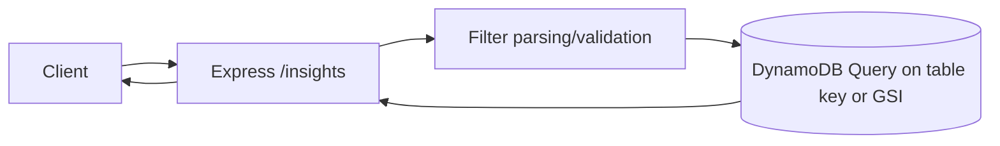
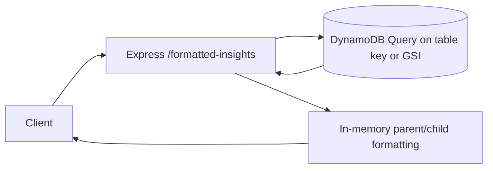
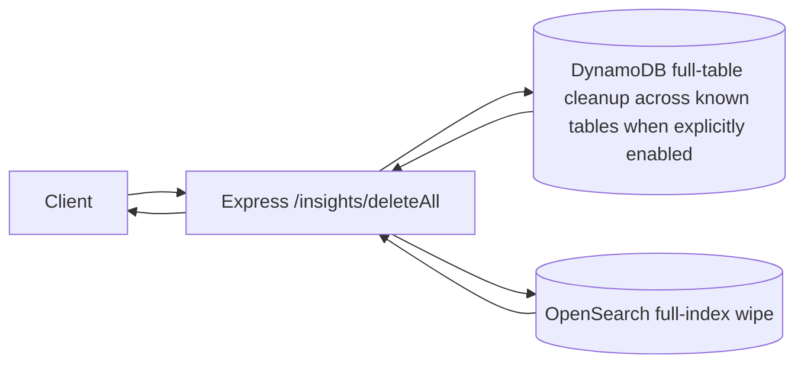
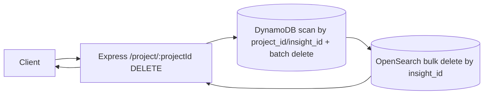
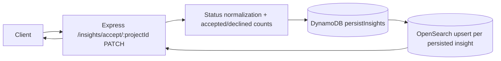
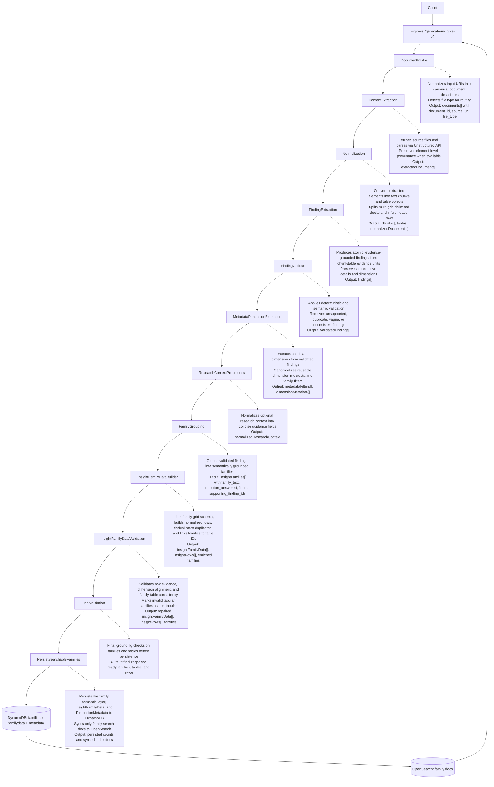

# Aetio Backend (TypeScript)

## Run locally

```bash
npm install
npm run dev
```

To run with local AWS profile:

```bash
AWS_PROFILE=amplify-policy-348665872628 AWS_REGION=us-east-2 npm run dev
```

## Build + run

```bash
npm run build
npm start
```

## Integration test

```bash
npm run test:v2
```

Environment variables often used in tests/scripts:

- `AETIO_BACKEND_URL`
- `GENERATE_INSIGHTS_V2_TEST_OUTPUT_URIS`
- `GENERATE_INSIGHTS_V2_TEST_CONTEXT_URIS`
- `GENERATE_INSIGHTS_V2_TEST_RESEARCH_CONTEXT`

## API Overview

Base URL (local): `http://localhost:8000`

Public endpoints:

- `GET /health`
- `GET /insights`
- `GET /formatted-insights`
- `GET /projects/:projectId`
- `DELETE /insights/deleteAll`
- `DELETE /project/:projectId`
- `PATCH /insights/accept/:projectId`
- `POST /generate-insights-v2`

Note: Insight detail endpoints (`GET /insight/:insightId`, `GET /insight/tree/:insightId`) are served by `aetio-search`.

---

## `GET /health`

Description: Lightweight liveness check.

Input:

- Path params: none
- Query params: none
- Body: none

Output:

- `200 text/plain`: `ok`

System diagram:


---

## `GET /insights`

Description: Lists insights from DynamoDB with optional filters.

Input:

- Path params: none
- Query params (supported only):
  - `insight_id`
  - `project_id`
  - `parent_insight_id`
  - `text`
  - `user_id`
  - `status`
  - `s3_node`
  - `document_id`
- Notes:
  - TODO: Re-enable JWT `sub` -> `user_id` server-side filter enforcement for this endpoint.
  - Current behavior: query `user_id` is accepted as provided and is not overridden by JWT.
- Query value behavior:
  - `key=value` exact match
  - `key=a,b,c` OR match among values
  - repeated params `?key=a&key=b` OR match
  - `key=null` means attribute does not exist
- Body: none

Output:

- `200 application/json`

```json
{
  "count": 2,
  "items": [
    {
      "insight_id": "...",
      "text": "...",
      "s3_node": "...",
      "document_id": "..."
    }
  ]
}
```

- `400` when unsupported query keys are passed
- `500` on internal errors

System diagram:



## `GET /formatted-insights`

Description: Lists insights and adds `sub_insights` arrays for parent items.

Input:

- Same query/filter behavior as `GET /insights`

Output:

- `200 application/json`

```json
{
  "count": 2,
  "items": [
    {
      "insight_id": "parent-id",
      "text": "Parent",
      "sub_insights": [
        {
          "insight_id": "child-id",
          "parent_insight_id": "parent-id",
          "text": "Child"
        }
      ]
    }
  ]
}
```

- `400` when unsupported query keys are passed
- `500` on internal errors

System diagram:



---

## `DELETE /insights/deleteAll`

Description: Deletes all records in the configured insights table and related known tables (`dimensionmetadata`, `insightfamilydata`, `insight_evaluation_traces`, `insight_review_events`, `projects`), plus the OpenSearch index.
This route is intentionally blocked unless `ENABLE_UNSAFE_DELETE_ALL_INSIGHTS=true` is set on the backend process.

Input:

- Path params: none
- Query params: none
- Body: none

Output:

- `200 application/json`

```json
{
  "deleted": 123,
  "deletedFromDimensionMetadata": 45,
  "deletedFromInsightFamilyData": 45,
  "deletedFromInsightEvaluationTraces": 123,
  "deletedFromInsightReviewEvents": 200,
  "deletedFromProjects": 12,
  "deletedFromOpenSearch": 123
}
```

- `500` on internal errors

System diagram:



---

## `GET /projects/:projectId`

Description: Returns a project approval bundle by `project_id`.

Note: This endpoint requires a bearer token, but the project lookup is no longer scoped to the JWT `sub`/`user_id`.

---

## `DELETE /project/:projectId`

Description: Deletes project root insight and all insights with matching `project_id`.

Input:

- Path params:
  - `projectId` (required)
- Query params: none
- Body: none

Output:

- `200 application/json`

```json
{
  "deleted": 42,
  "deletedFromOpenSearch": 42,
  "projectId": "project-abc"
}
```

- `400` if `projectId` missing
- `500` on internal errors

System diagram:



---

## `PATCH /insights/accept/:projectId`

Description: Persists acceptance decisions for insights. Non-declined statuses are normalized to `Accepted`, then project-level acceptance counts are written into the root insight `additional_refs`.

Input:

- Path params:
  - `projectId` (required)
- Body (either form):

```json
[
  {
    "insight_id": "...",
    "text": "...",
    "s3_node": "...",
    "document_id": "...",
    "status": "Declined"
  }
]
```

or

```json
{
  "insights": [
    {
      "insight_id": "...",
      "text": "...",
      "s3_node": "...",
      "document_id": "...",
      "status": "Accepted"
    }
  ]
}
```

Output:

- `200 application/json`

```json
{
  "updated": 10,
  "items": [
    {
      "insight_id": "...",
      "status": "Accepted"
    }
  ]
}
```

- `400` if `projectId` missing or body is not a valid insights array
- `500` on internal errors

System diagram:



## `POST /generate-insights-v2`

Description: Runs the v2 findings-first pipeline for mixed-source documents and returns grounded semantic families, persisted family grids, and reusable dimension metadata.

Input:

- Body:

```json
{
  "outputUrls": [
    "s3://bucket/scholarly-article-with-table.pdf",
    "s3://bucket/segmented-metrics.xlsx",
    "s3://bucket/third-party-report.pdf"
  ],
  "contextUrls": ["s3://bucket/context-summary.pdf"],
  "rawDataUrls": [],
  "researchContext": "Optional analysis lens",
  "uploadMode": "document",
  "userInfo": { "full_name": "Analyst", "email_address": "analyst@example.com" },
  "projectId": "optional-project-id",
  "organizationId": "optional-org-id",
  "status": "optional-status"
}
```

- `sourceUris` is accepted as an alias for `outputUrls`.
- The API currently requires at least one `outputUrls`/`sourceUris` value.
- `contextUrls` are merged with `outputUrls` for extraction (`sourceUris = outputUrls + contextUrls`).
- Required header:
  - `Authorization: Bearer <jwt>` (JWT `sub` is used as `userId`)
- Optional header:
  - `x-request-id` (if absent, server generates UUID)

Output:

- `200 application/json`

```json
{
  "documents": [{ "document_id": "...", "source_uri": "s3://...", "file_type": "pdf" }],
  "findings": [{ "finding_id": "...", "text": "...", "dimensions": [], "supporting_refs": [] }],
  "insight_families": [
    {
      "insight_id": "...",
      "family_id": "...",
      "family_text": "Conversion performance differs across marketing channels and age groups",
      "question_answered": "How does conversion performance vary across channels and demographic segments?",
      "filters": ["channel", "age_group"],
      "has_grid": true,
      "insight_family_data_id": "table-...",
      "row_count": 3,
      "table_dimensions": ["Channel", "Age Group"],
      "metric_columns": ["conversion_rate_change"],
      "summary": "Optional family summary",
      "supporting_finding_ids": ["..."]
    }
  ],
  "insight_rows": [],
  "insight_family_data": [
    {
      "table_id": "table-...",
      "family_id": "...",
      "dimensions": ["Channel", "Age Group"],
      "metric_columns": ["conversion_rate_change"],
      "row_count": 3,
      "rows": []
    }
  ],
  "dimension_metadata": [
    {
      "dimension_id": "dim_...",
      "canonical_name": "age_group",
      "allowed_values": []
    }
  ]
}
```

- `400` if `sourceUris`/`outputUrls` is missing or empty
- `401` if JWT bearer token is missing/invalid
- `500` on internal errors

### generate-insights-v2 workflow nodes and responsibilities

| Node | Responsibility | Key Output |
|---|---|---|
| `DocumentIntake` | Normalizes input URIs into canonical document descriptors and detects file type for routing. | `documents[]` with `document_id`, `source_uri`, `file_type` |
| `ContentExtraction` | Fetches source files and parses via Unstructured API, preserving element-level provenance (page/section/type/sheet metadata when available). | `extractedDocuments[]` |
| `Normalization` | Converts extracted elements into first-class text chunks and table objects. For delimited text, splits multi-grid blocks and infers structural header rows. | `chunks[]`, `tables[]`, `normalizedDocuments[]` |
| `FindingExtraction` | Produces atomic, evidence-grounded findings from chunk/table evidence units, preserving quantitative details and dimensions. | `findings[]` |
| `FindingCritique` | Applies deterministic + semantic validation to remove unsupported, duplicate, vague, or inconsistent findings. | `validatedFindings[]` |
| `MetadataDimensionExtraction` | Extracts candidate dimensions from validated findings, canonicalizes reusable dimension metadata, and derives family filter candidates. | `metadataFilters[]`, `dimensionMetadata[]` |
| `ResearchContextPreprocess` | Normalizes optional research context into concise guidance fields (`short_summary`, `key_topics`, `key_questions`). | `normalizedResearchContext` |
| `FamilyGrouping` | Groups validated findings into semantically grounded families (`family_text`, `question_answered`, `filters`, `supporting_finding_ids`). | `insightFamilies[]` |
| `InsightFamilyDataBuilder` | Infers family grid schema, builds normalized rows, deduplicates duplicate rows, and links families to table IDs. | `insightFamilyData[]`, `insightRows[]`, enriched families |
| `InsightFamilyDataValidation` | Validates row evidence, dimension alignment, and family-table consistency; marks invalid tabular families as non-tabular. | repaired `insightFamilyData[]`, `insightRows[]`, families |
| `FinalValidation` | Final grounding checks on families and tables before persistence. | final response-ready families/tables/rows |
| `PersistSearchableFamilies` | Persists family semantic layer, full `InsightFamilyData`, and `DimensionMetadata` to DynamoDB; syncs only family search docs to OpenSearch. | persisted counts and synced index docs |

### Data model boundary

- `InsightFamily` (semantic/search layer):
  - `family_text`, `question_answered`, `filters`, `has_grid`, `insight_family_data_id`, `row_count`, linkage/auth fields.
- `InsightFamilyData` (full persisted normalized row table):
  - `table_id`, `family_id`, `dimensions`, `metric_columns`, `rows[]`, `row_count`.
  - Persists all supported normalized rows; no unsupported Cartesian products.
- `DimensionMetadata` (reusable schema layer):
  - canonical dimensions/values, aliases/synonyms, optional hierarchies, normalization behavior.

### CSV/XLSX handling notes

- Multiple grids in one extracted table element are supported for delimited text blocks:
  - separator rows split blocks;
  - header row is inferred using structural heuristics;
  - each block becomes its own normalized table.
- Placeholder dimension names are excluded from metadata/filter schema:
  - `unnamed_*`, `column_*` (and variants) are treated as non-reusable dimensions.
- `insight_family_data.dimensions` prefers original source labels where available (for product rendering), while row filters still reference canonical metadata IDs.

### Persistence and indexing boundary

- Persisted in DynamoDB:
  - family semantic records (`insights` table)
  - `InsightFamilyData` table (`insightfamilydata`)
  - `DimensionMetadata` table (`dimensionmetadata`)
- Family-level record fields include:
  - `insight_id` (family id)
  - `family_text` / `text`
  - `question_answered`
  - `summary`
  - `filters`
  - `has_grid`, `insight_family_data_id`, `row_count`, `table_dimensions`, `metric_columns`
  - family-level `metadata`
  - `project_id`, `user_id`, `organization_id` (when provided)
  - `document_id` + `document_ids`
  - `source_types`
  - `status`, timestamps
- Indexed in OpenSearch (family-level projection only):
  - `insight_id`, `family_text`, `question_answered`, `summary`
  - `filters`, family metadata
  - `has_grid`, `insight_family_data_id`, `row_count`, `table_dimensions`, `metric_columns`
  - `project_id`, `user_id`, `organization_id`
  - `document_ids`, `source_types`, `status`, timestamps
  - derived `searchable_text`
- Intentionally NOT indexed in OpenSearch:
  - full row payloads from `InsightFamilyData`
  - full `DimensionMetadata` payloads
- Intentionally kept as source artifacts (not product semantic rows):
  - raw extracted tables/cells
  - transient normalization/intermediate workflow artifacts

System diagram (vertical):



### Useful tests and scripts

- Unit tests (selected):
  - `src/generate-insights-v2/__tests__/normalizeContent.subgrids.test.ts`
  - `src/generate-insights-v2/__tests__/extractFindings.tableContext.test.ts`
  - `src/generate-insights-v2/__tests__/metadataService.test.ts`
  - `src/generate-insights-v2/__tests__/insightFamilyDataBuilder.test.ts`
  - `src/generate-insights-v2/__tests__/persistSearchableFamilies.insightFamilyData.test.ts`
- Integration scripts:
  - `scripts/generate-insights-v2-test.mjs`
  - `scripts/generate-insights-v2-s3-validate.mjs`

---
## Pending TODOs

- `src/common/services/dynamo.ts`: fixed-index query paths (`insight_id` PK and GSIs `GSI_UserId`/`GSI_DocumentId`/`GSI_ParentInsightId`/`GSI_Status`) with a project-delete scan fallback.
- `src/generate-insights/agents/semanticRevisionPlanner.ts`: TODO reassess deletion policy; `remove` actions are currently downgraded and retained.
- `src/generate-insights/agents/revisionApplier.ts`: TODO reassess deletion policy; suspected hallucinations are currently retained with lowered confidence.
- `src/index.ts` (`GET /insights`): TODO re-enable JWT `sub` -> `user_id` filter enforcement.
- `src/index.ts`: TODO marker for existing ref-handling cleanup.

---

## Quick Example Request

```bash
curl -X POST http://localhost:8000/generate-insights-v2 \
  -H "authorization: Bearer <jwt-with-sub>" \
  -H "content-type: application/json" \
  -H "x-request-id: local" \
  -d '{
    "outputUrls": ["s3://bucket/report.pdf"],
    "contextUrls": ["s3://bucket/overview.pdf"],
    "researchContext": "Optional project summary"
  }'
```

## Utility script

Delete all records:

```bash
ENABLE_UNSAFE_DELETE_ALL_INSIGHTS=true \
node scripts/delete-all-insights.mjs
```

Search has been moved to the `aetio-search` service.
