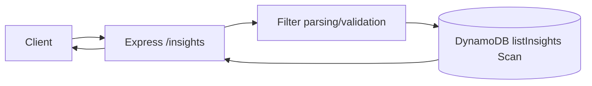
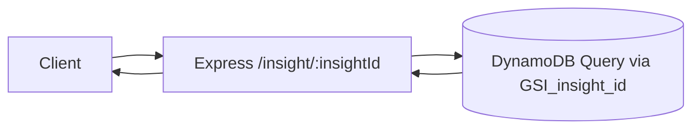
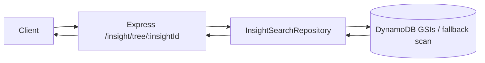
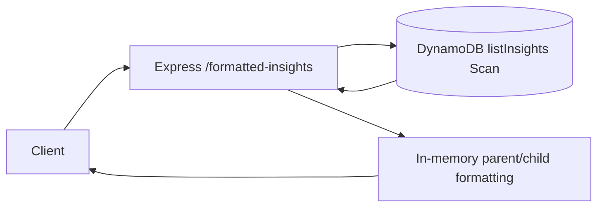
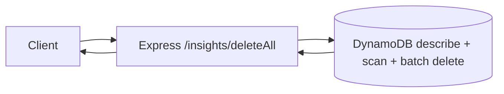
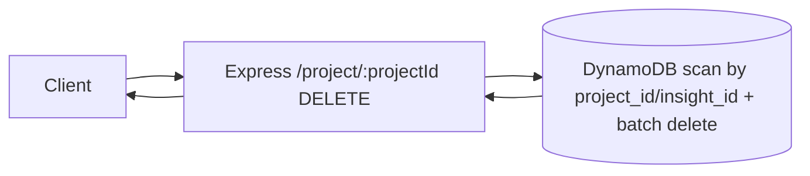
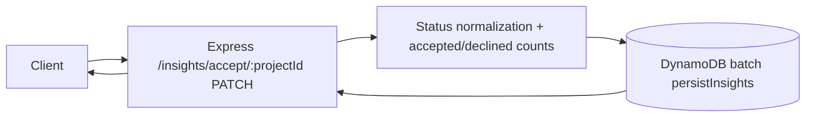
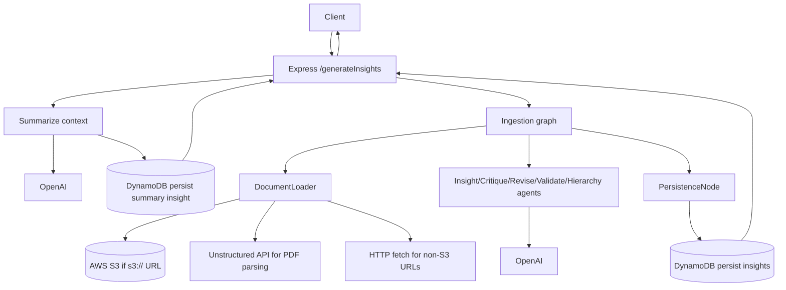

# Aetio Backend (TypeScript)

## Run locally

```bash
npm install
npm run dev
```

To run with local AWS profile:

```bash
AWS_PROFILE=amplify-policy-348665872628 AWS_REGION=us-east-2 npm run dev
```

## Build + run

```bash
npm run build
npm start
```

## Integration test

```bash
npm run test:integration
```

Environment variables often used in tests/scripts:

- `AETIO_BACKEND_URL`
- `AETIO_TEST_USER_ID`
- `AETIO_TEST_OUTPUT_URL`
- `AETIO_TEST_CONTEXT_URL`

## API Overview

Base URL (local): `http://localhost:8000`

Public endpoints:

- `GET /health`
- `GET /insights`
- `GET /insight/:insightId`
- `GET /insight/tree/:insightId`
- `GET /formatted-insights`
- `DELETE /insights/deleteAll`
- `DELETE /project/:projectId`
- `PATCH /insights/accept/:projectId`
- `POST /generateInsights`

---

## `GET /health`

Description: Lightweight liveness check.

Input:

- Path params: none
- Query params: none
- Body: none

Output:

- `200 text/plain`: `ok`

System diagram:


---

## `GET /insights`

Description: Lists insights from DynamoDB with optional filters.

Input:

- Path params: none
- Query params (supported only):
  - `insight_id`
  - `project_id`
  - `parent_insight_id`
  - `text`
  - `user_id`
  - `status`
  - `s3_node`
  - `document_id`
- Query value behavior:
  - `key=value` exact match
  - `key=a,b,c` OR match among values
  - repeated params `?key=a&key=b` OR match
  - `key=null` means attribute does not exist
- Body: none

Output:

- `200 application/json`

```json
{
  "count": 2,
  "items": [
    {
      "insight_id": "...",
      "text": "...",
      "s3_node": "...",
      "document_id": "..."
    }
  ]
}
```

- `400` when unsupported query keys are passed
- `500` on internal errors

System diagram:



---

## `GET /insight/:insightId`

Description: Fetches one insight by `insight_id`.

Input:

- Path params:
  - `insightId` (required)
- Query params: none
- Body: none

Output:

- `200 application/json` Insight object
- `404` if not found
- `400` if `insightId` missing
- `500` on internal errors

System diagram:



---

## `GET /insight/tree/:insightId`

Description: Returns the target insight plus nearby hierarchy context.

Input:

- Path params:
  - `insightId` (required)
- Query params: none
- Body: none

Output:

- `200 application/json`

```json
{
  "insight": [ { "insight_id": "..." } ],
  "children": [ { "insight_id": "...", "parent_insight_id": "..." } ],
  "parents": [ { "insight_id": "..." } ],
  "siblings": [ { "insight_id": "...", "parent_insight_id": "..." } ]
}
```

- `404` if root insight not found
- `400` if `insightId` missing
- `500` on internal errors

System diagram:



---

## `GET /formatted-insights`

Description: Lists insights and adds `sub_insights` arrays for parent items.

Input:

- Same query/filter behavior as `GET /insights`

Output:

- `200 application/json`

```json
{
  "count": 2,
  "items": [
    {
      "insight_id": "parent-id",
      "text": "Parent",
      "sub_insights": [
        {
          "insight_id": "child-id",
          "parent_insight_id": "parent-id",
          "text": "Child"
        }
      ]
    }
  ]
}
```

- `400` when unsupported query keys are passed
- `500` on internal errors

System diagram:



---

## `DELETE /insights/deleteAll`

Description: Deletes all records in the configured insights table.

Input:

- Path params: none
- Query params: none
- Body: none

Output:

- `200 application/json`

```json
{ "deleted": 123 }
```

- `500` on internal errors

System diagram:



---

## `DELETE /project/:projectId`

Description: Deletes project root insight and all insights with matching `project_id`.

Input:

- Path params:
  - `projectId` (required)
- Query params: none
- Body: none

Output:

- `200 application/json`

```json
{ "deleted": 42, "projectId": "project-abc" }
```

- `400` if `projectId` missing
- `500` on internal errors

System diagram:



---

## `PATCH /insights/accept/:projectId`

Description: Persists acceptance decisions for insights. Non-declined statuses are normalized to `Accepted`, then project-level acceptance counts are written into the root insight `additional_refs`.

Input:

- Path params:
  - `projectId` (required)
- Body (either form):

```json
[
  {
    "insight_id": "...",
    "text": "...",
    "s3_node": "...",
    "document_id": "...",
    "status": "Declined"
  }
]
```

or

```json
{
  "insights": [
    {
      "insight_id": "...",
      "text": "...",
      "s3_node": "...",
      "document_id": "...",
      "status": "Accepted"
    }
  ]
}
```

Output:

- `200 application/json`

```json
{
  "updated": 10,
  "items": [
    {
      "insight_id": "...",
      "status": "Accepted"
    }
  ]
}
```

- `400` if `projectId` missing or body is not a valid insights array
- `500` on internal errors

System diagram:



---

## `POST /generateInsights`

Description: Kicks off the insight generation pipeline and returns a `202 Accepted` response when processing completes successfully in-process.

Input:

- Body:

```json
{
  "userId": "user-123",
  "userInfo": {
    "full_name": "Jane Doe",
    "email_address": "jane@example.com"
  },
  "outputUrls": ["https://example.com/report.pdf"],
  "contextUrls": ["https://example.com/context.pdf"],
  "researchContext": "Optional project context",
  "image_blocks": [
    { "block_id": "b1", "image_s3": "s3://bucket/path/img.png", "page": 1 }
  ],
  "document_id": "optional-doc-id"
}
```

- Required fields:
  - `userId`
  - `outputUrls` (non-empty array)
- Optional header:
  - `x-request-id` (if absent, server generates UUID)

Output:

- `202 application/json`

```json
{
  "status": "accepted",
  "requestId": "...",
  "ok": true,
  "insights": 32,
  "documents": 2,
  "chunks": 18,
  "image_chunks": 0,
  "summary": "...",
  "errors": []
}
```

- `400` if required fields are missing
- `500` on internal errors (includes `requestId`)

System diagram:



---

## Quick Example Request

```bash
curl -X POST http://localhost:8000/generateInsights \
  -H "content-type: application/json" \
  -H "x-request-id: local" \
  -d '{
    "userId": "user-123",
    "outputUrls": ["https://example.com/report.pdf"],
    "contextUrls": ["https://example.com/overview.pdf"],
    "researchContext": "Optional project summary"
  }'
```

## Utility script

Delete all records:

```bash
node scripts/delete-all-insights.mjs
```

Search has been moved to the `aetio-search` service.
