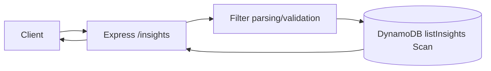
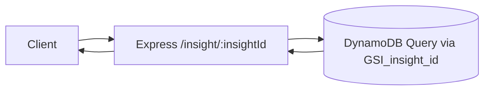
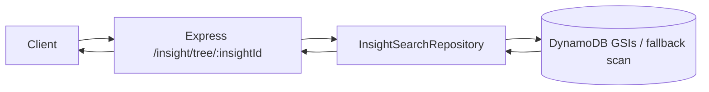
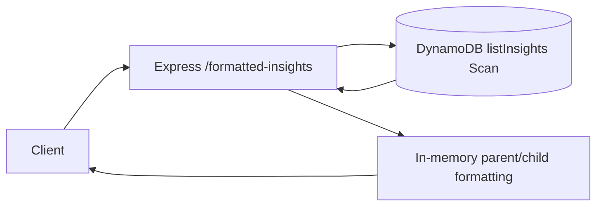
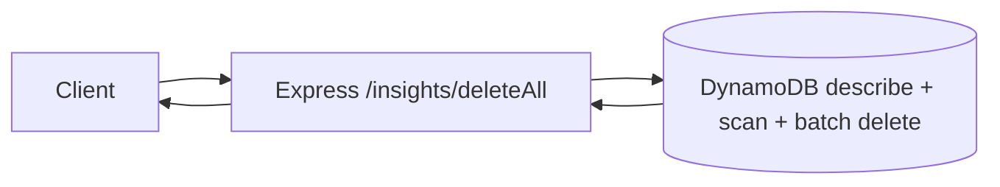
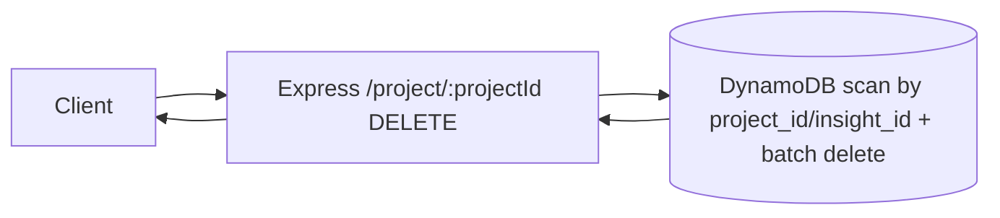
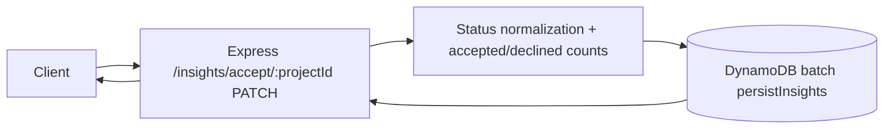

# Aetio Backend (TypeScript)

## Run locally

```bash
npm install
npm run dev
```

To run with local AWS profile:

```bash
AWS_PROFILE=amplify-policy-348665872628 AWS_REGION=us-east-2 npm run dev
```

## Build + run

```bash
npm run build
npm start
```

## Integration test

```bash
npm run test:integration
```

Environment variables often used in tests/scripts:

- `AETIO_BACKEND_URL`
- `AETIO_TEST_USER_ID`
- `AETIO_TEST_OUTPUT_URL`
- `AETIO_TEST_CONTEXT_URL`

## API Overview

Base URL (local): `http://localhost:8000`

Public endpoints:

- `GET /health`
- `GET /insights`
- `GET /insight/:insightId`
- `GET /insight/tree/:insightId`
- `GET /formatted-insights`
- `DELETE /insights/deleteAll`
- `DELETE /project/:projectId`
- `PATCH /insights/accept/:projectId`
- `POST /generateInsights`

---

## `GET /health`

Description: Lightweight liveness check.

Input:

- Path params: none
- Query params: none
- Body: none

Output:

- `200 text/plain`: `ok`

System diagram:


---

## `GET /insights`

Description: Lists insights from DynamoDB with optional filters.

Input:

- Path params: none
- Query params (supported only):
  - `insight_id`
  - `project_id`
  - `parent_insight_id`
  - `text`
  - `user_id`
  - `status`
  - `s3_node`
  - `document_id`
- Query value behavior:
  - `key=value` exact match
  - `key=a,b,c` OR match among values
  - repeated params `?key=a&key=b` OR match
  - `key=null` means attribute does not exist
- Body: none

Output:

- `200 application/json`

```json
{
  "count": 2,
  "items": [
    {
      "insight_id": "...",
      "text": "...",
      "s3_node": "...",
      "document_id": "..."
    }
  ]
}
```

- `400` when unsupported query keys are passed
- `500` on internal errors

System diagram:



---

## `GET /insight/:insightId`

Description: Fetches one insight by `insight_id`.

Input:

- Path params:
  - `insightId` (required)
- Query params: none
- Body: none

Output:

- `200 application/json` Insight object
- `404` if not found
- `400` if `insightId` missing
- `500` on internal errors

System diagram:



---

## `GET /insight/tree/:insightId`

Description: Returns the target insight plus nearby hierarchy context.

Input:

- Path params:
  - `insightId` (required)
- Query params: none
- Body: none

Output:

- `200 application/json`

```json
{
  "insight": [ { "insight_id": "..." } ],
  "children": [ { "insight_id": "...", "parent_insight_id": "..." } ],
  "parents": [ { "insight_id": "..." } ],
  "siblings": [ { "insight_id": "...", "parent_insight_id": "..." } ]
}
```

- `404` if root insight not found
- `400` if `insightId` missing
- `500` on internal errors

System diagram:



---

## `GET /formatted-insights`

Description: Lists insights and adds `sub_insights` arrays for parent items.

Input:

- Same query/filter behavior as `GET /insights`

Output:

- `200 application/json`

```json
{
  "count": 2,
  "items": [
    {
      "insight_id": "parent-id",
      "text": "Parent",
      "sub_insights": [
        {
          "insight_id": "child-id",
          "parent_insight_id": "parent-id",
          "text": "Child"
        }
      ]
    }
  ]
}
```

- `400` when unsupported query keys are passed
- `500` on internal errors

System diagram:



---

## `DELETE /insights/deleteAll`

Description: Deletes all records in the configured insights table.

Input:

- Path params: none
- Query params: none
- Body: none

Output:

- `200 application/json`

```json
{ "deleted": 123 }
```

- `500` on internal errors

System diagram:



---

## `DELETE /project/:projectId`

Description: Deletes project root insight and all insights with matching `project_id`.

Input:

- Path params:
  - `projectId` (required)
- Query params: none
- Body: none

Output:

- `200 application/json`

```json
{ "deleted": 42, "projectId": "project-abc" }
```

- `400` if `projectId` missing
- `500` on internal errors

System diagram:



---

## `PATCH /insights/accept/:projectId`

Description: Persists acceptance decisions for insights. Non-declined statuses are normalized to `Accepted`, then project-level acceptance counts are written into the root insight `additional_refs`.

Input:

- Path params:
  - `projectId` (required)
- Body (either form):

```json
[
  {
    "insight_id": "...",
    "text": "...",
    "s3_node": "...",
    "document_id": "...",
    "status": "Declined"
  }
]
```

or

```json
{
  "insights": [
    {
      "insight_id": "...",
      "text": "...",
      "s3_node": "...",
      "document_id": "...",
      "status": "Accepted"
    }
  ]
}
```

Output:

- `200 application/json`

```json
{
  "updated": 10,
  "items": [
    {
      "insight_id": "...",
      "status": "Accepted"
    }
  ]
}
```

- `400` if `projectId` missing or body is not a valid insights array
- `500` on internal errors

System diagram:



---

## `POST /generateInsights`

Description: Kicks off the insight generation pipeline and returns a `202 Accepted` response when processing completes successfully in-process.

Input:

- Body:

```json
{
  "userInfo": {
    "full_name": "Jane Doe",
    "email_address": "jane@example.com"
  },
  "user_info": {
    "full_name": "Jane Doe",
    "email_address": "jane@example.com"
  },
  "outputUrls": ["https://example.com/report.pdf"],
  "contextUrls": ["https://example.com/context.pdf"],
  "researchContext": "Optional project context",
  "image_blocks": [
    { "block_id": "b1", "image_s3": "s3://bucket/path/img.png", "page": 1 }
  ],
  "document_id": "optional-doc-id"
}
```

- Required fields:
  - `outputUrls` (non-empty array)
- Required header:
  - `Authorization: Bearer <jwt>` (JWT `sub` is used as `userId`)
- Optional header:
  - `x-request-id` (if absent, server generates UUID)
- Notes:
  - Request `userId` in body is ignored/overwritten by JWT `sub`.
  - Both `userInfo` and `user_info` are accepted.

Output:

- `202 application/json`

```json
{
  "status": "accepted",
  "requestId": "...",
  "ok": true,
  "insights": 32,
  "documents": 2,
  "chunks": 18,
  "image_chunks": 0,
  "summary": "...",
  "errors": []
}
```

- `400` if required fields are missing
- `500` on internal errors (includes `requestId`)

System diagram:

```mermaid
flowchart TD
  C[Client] --> API[Express /generateInsights]
  API --> SUM[SummarizeProject]
  SUM --> SA[SummarizeAgent]
  SA --> OAI1[OpenAI]
  SUM --> DDB1[(DynamoDB persist summary root insight)]

  API --> G[buildIngestionGraph]
  G --> DL[DocumentLoader]
  DL --> S3[(AWS S3 fetch for s3:// URLs)]
  DL --> UST[Unstructured API parsing]
  DL --> WEB[HTTP fetch for web URLs]

  DL --> CH[ChunkingNode]
  CH --> FE[FindingExtractionAgent]
  FE --> OAI2[OpenAI]
  FE --> FB[FindingBatchingAgent]
  FB --> IE[InsightExtractionAgent]
  IE --> OAI3[OpenAI]
  IE --> CBM[CrossBatchMergeAgent]
  CBM --> CR[CritiqueAgent]
  CR --> DC[DeterministicCritiqueAgent]
  CR --> SC[SemanticCritiqueAgent]
  SC --> OAI4[OpenAI]
  CR --> RV[ReviseAgent]
  RV --> SRP[SemanticRevisionPlanner]
  SRP --> OAI5[OpenAI]
  RV --> RA[RevisionApplier]
  RV --> VA[ValidateAgent]
  VA --> MC[MetadataConsolidationAgent]
  MC --> HF[HierarchyFinalizeAgent (deterministic)]
  HF --> PERSIST[PersistenceNode]
  PERSIST --> DDB2[(DynamoDB persist finalized insights)]

  DDB2 --> API
  API --> C
```

### Generate-insights agents and nodes

| Node / Agent | What it does | Why it is needed |
|---|---|---|
| `SummarizeProject` + `SummarizeAgent` | Generates a project/context summary and persists it as a root insight before document ingestion. | Gives each run a project-level anchor (`projectId`) and shared context for downstream hierarchy attachment. |
| `DocumentLoader` | Loads source content from S3/HTTP and parses documents (including PDF parsing flow). | Normalizes heterogeneous sources into a consistent document payload. |
| `ChunkingNode` | Splits loaded documents into structured chunks. | Creates manageable evidence units for extraction and traceability. |
| `FindingExtractionAgent` | Uses LLM extraction over chunks to produce concrete findings with evidence references. | Establishes a grounded evidence layer before higher-level insight synthesis. |
| `FindingBatchingAgent` | Groups findings into bounded batches. | Controls token/latency/cost and improves extraction stability for insight generation. |
| `InsightExtractionAgent` | Produces insights (and local parent-child links) from finding batches. | Converts raw findings into reusable insight objects with supporting evidence. |
| `CrossBatchMergeAgent` | Deterministically deduplicates/merges near-duplicate insights across batches and remaps parent refs. | Prevents fragmented duplicate insights caused by batch boundaries. |
| `CritiqueAgent` | Orchestrates critique pass by combining deterministic and semantic critique signals. | Central quality gate before revision. |
| `DeterministicCritiqueAgent` | Applies rule-based checks (missing support, hierarchy issues, metadata issues). | Fast, predictable validation for objective defects. |
| `SemanticCritiqueAgent` | Uses LLM critique for nuanced semantic weaknesses not captured by rules. | Catches subtle quality issues that require language understanding. |
| `ReviseAgent` | Orchestrates revision planning + deterministic application of revisions. | Converts critique into actionable changes while preserving control. |
| `SemanticRevisionPlanner` | Uses LLM to propose structured revision actions. | Produces targeted fixes for semantic issues in a machine-readable plan. |
| `RevisionApplier` | Deterministically applies revision actions, resolves merges/removals, and enforces hierarchy integrity. | Ensures revision execution is safe, reproducible, and schema-consistent. |
| `ValidateAgent` | Final validation pass for support, metadata normalization, and parent-reference sanity. | Filters/normalizes remaining invalid insights before persistence. |
| `MetadataConsolidationAgent` | Consolidates/deduplicates metadata entries per insight. | Produces stable metadata shape for querying and downstream usage. |
| `HierarchyFinalizeAgent` | Deterministic hierarchy cleanup only: remove dangling/self/cyclic parent links and normalize roots. No LLM calls. | Final structural integrity pass immediately before persistence. |
| `PersistenceNode` | Persists finalized insights to DynamoDB. | Commits pipeline output as the system of record. |

---
## Pending TODOs

- `src/common/services/dynamo.ts`: TODO get rid of `Scan` usage.
- `src/generate-insights/handler.ts`: TODO persist `summary.additional_refs.pendingInsightsNum`.
- `src/generate-insights/agents/semanticRevisionPlanner.ts`: TODO reassess deletion policy; `remove` actions are currently downgraded and retained.
- `src/generate-insights/agents/revisionApplier.ts`: TODO reassess deletion policy; suspected hallucinations are currently retained with lowered confidence.
- `src/index.ts`: TODO marker for existing ref-handling cleanup.

---

## Quick Example Request

```bash
curl -X POST http://localhost:8000/generateInsights \
  -H "authorization: Bearer <jwt-with-sub>" \
  -H "content-type: application/json" \
  -H "x-request-id: local" \
  -d '{
    "outputUrls": ["https://example.com/report.pdf"],
    "contextUrls": ["https://example.com/overview.pdf"],
    "researchContext": "Optional project summary"
  }'
```

## Utility script

Delete all records:

```bash
node scripts/delete-all-insights.mjs
```

Search has been moved to the `aetio-search` service.
