# Aetio Engineering Leadership Presentation

A self-contained React, TypeScript, and Vite slide deck grounded in the Aetio frontend, backend, search, and table-understanding repositories.

Requires Node.js 20.20 or newer.

## Setup

```bash
cd presentation
npm install
```

## Run

```bash
npm run dev
```

Open the local URL printed by Vite. The deck does not call a backend and requires no network access after dependencies are installed.

## Build

```bash
npm run build
npm run preview
```

The production output is written to `presentation/dist/`.

## Static Preview

Generated from the local deck at `http://localhost:5173` so the presentation can be reviewed without running the app.
The successful refresh path was Playwright with local Chromium, run against the live local deck; if screenshots need to be updated later, start the Vite server, re-run the same Playwright capture flow, and overwrite the files in `presentation/readme-images/`.

### Main Deck

#### 01. Title

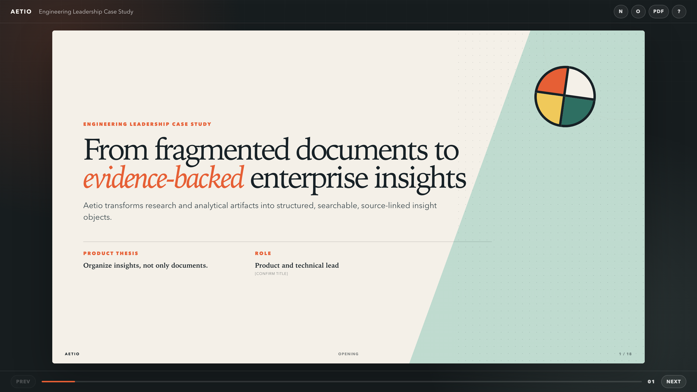

#### 02. Problem

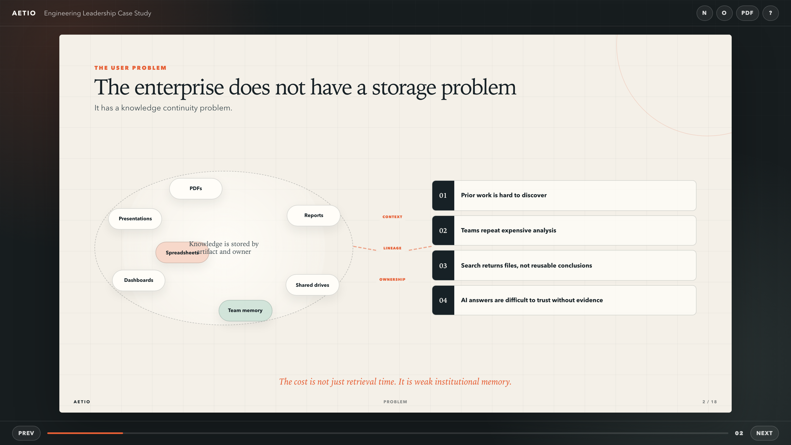

#### 03. Thesis

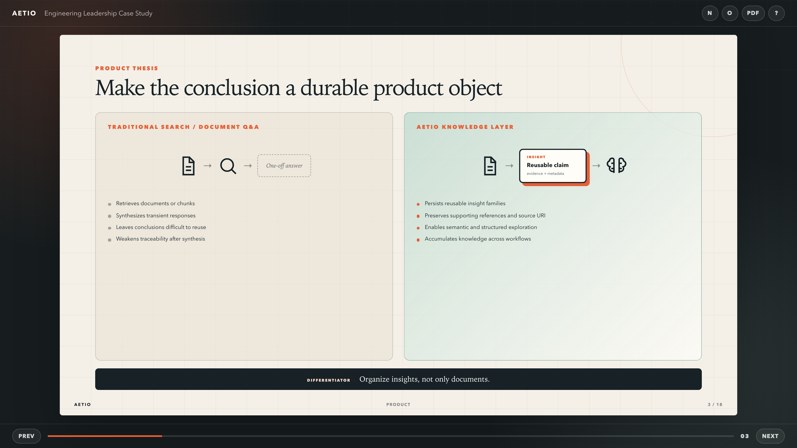

#### 04. Workflow

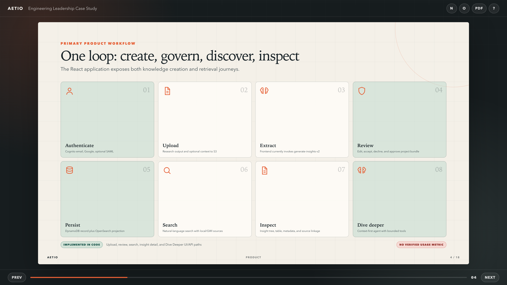

#### 05. Architecture

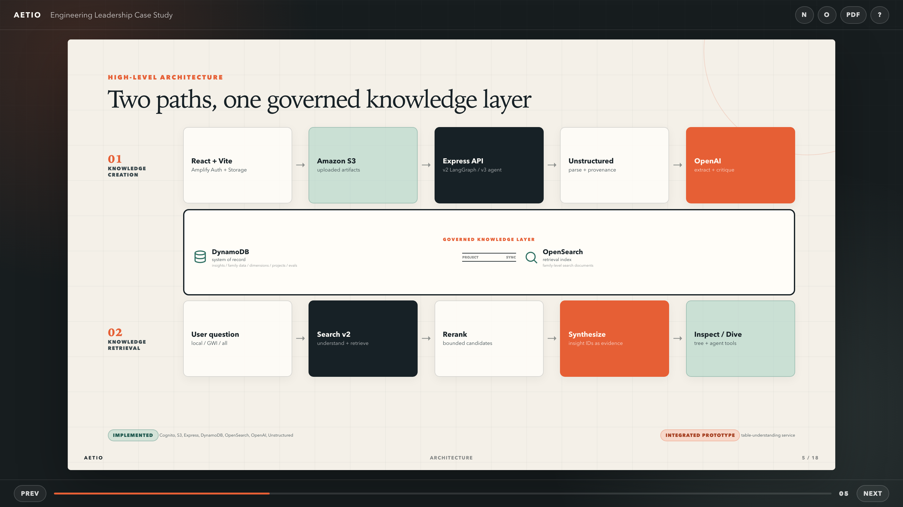

#### 06. Extraction

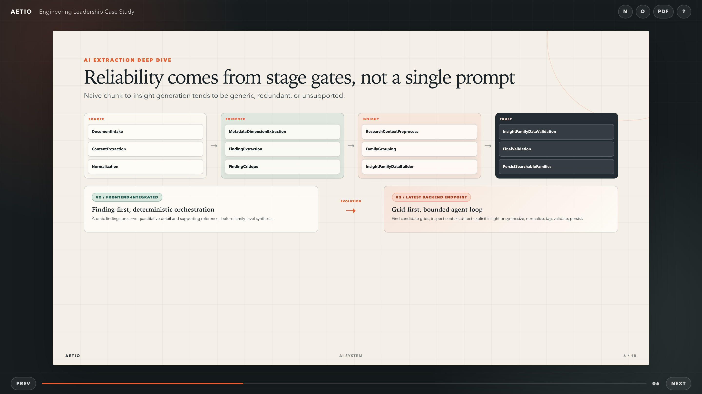

#### 07. Data Model

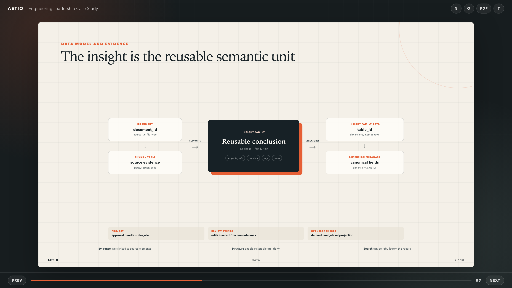

#### 08. Search

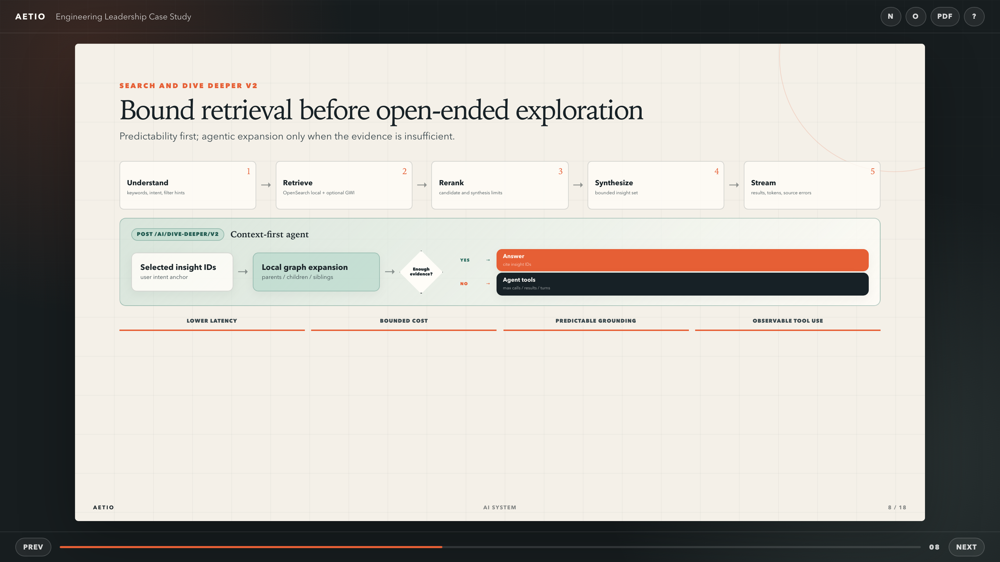

#### 09. Decisions

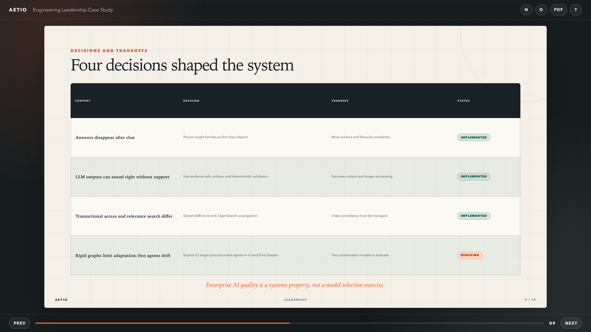

#### 10. Evolution

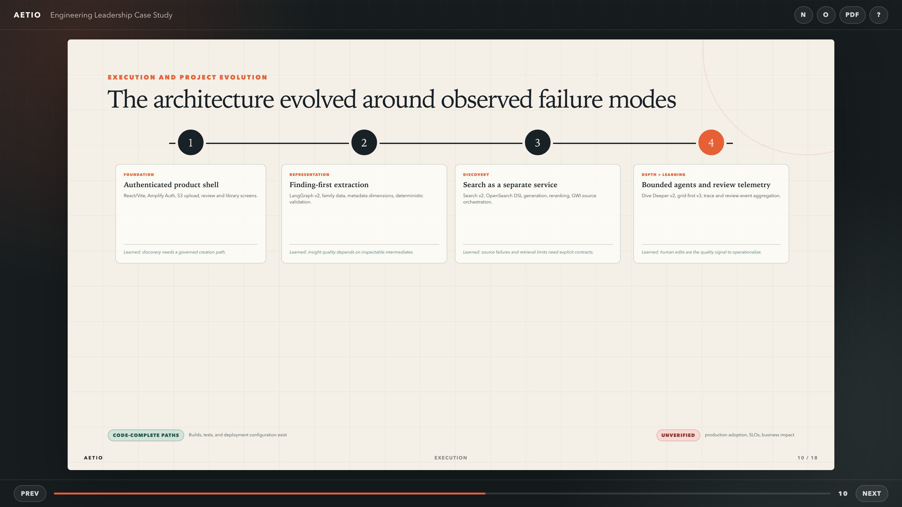

#### 11. Strategy

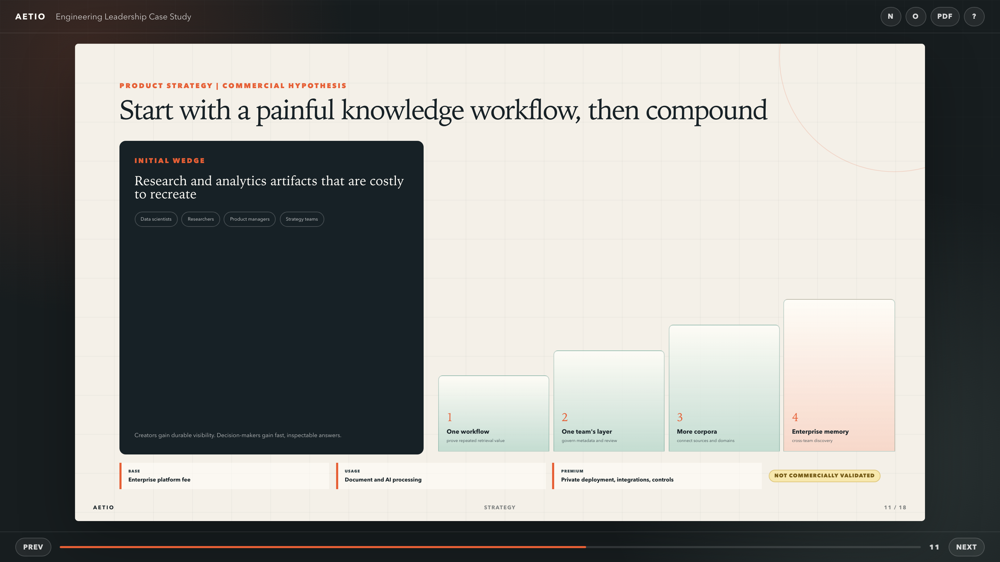

#### 12. Learning

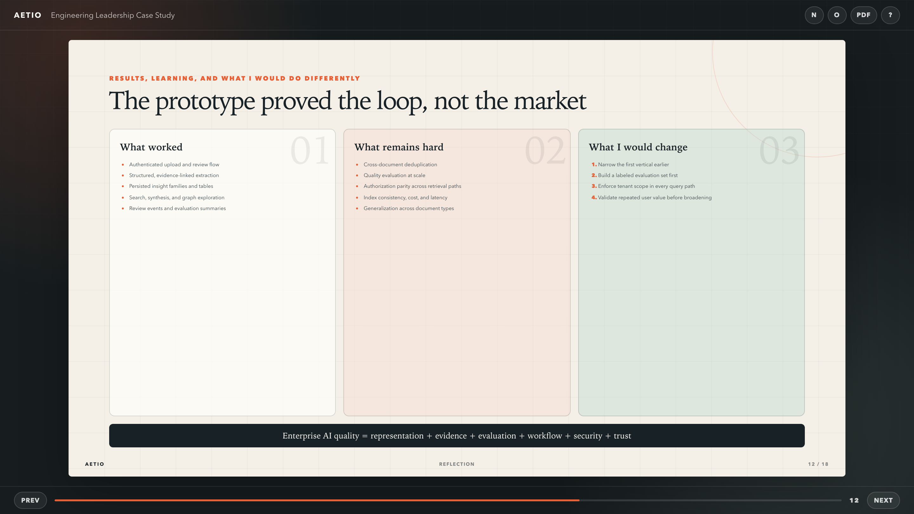

### Appendix

#### 13. AWS

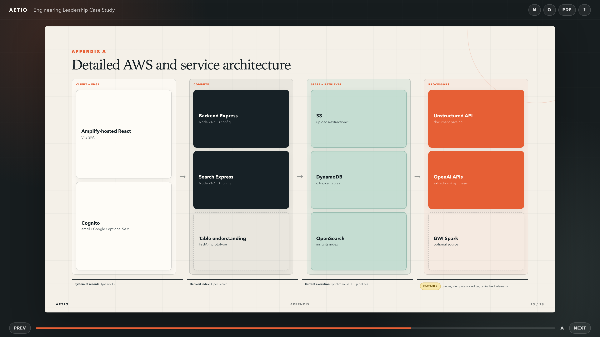

#### 14. Graphs

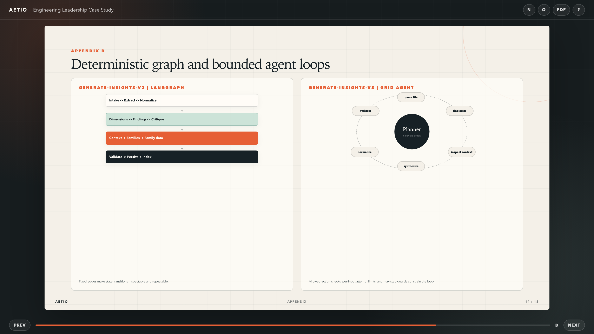

#### 15. API

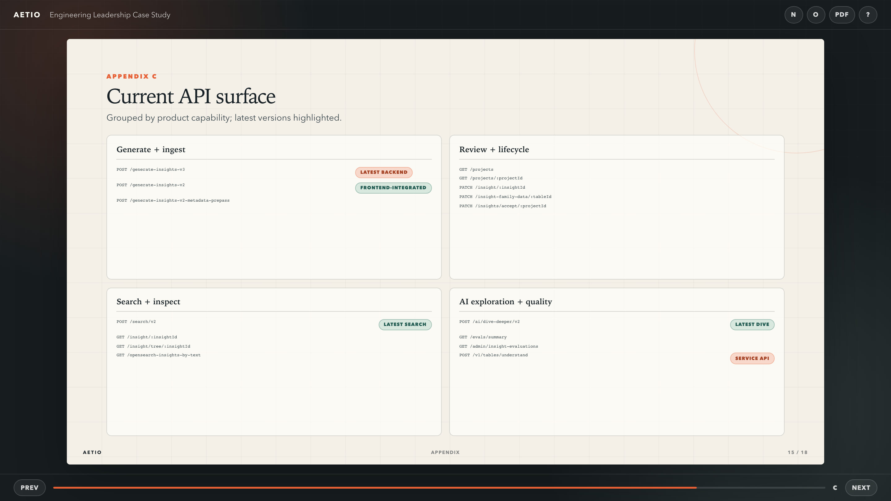

#### 16. Schemas

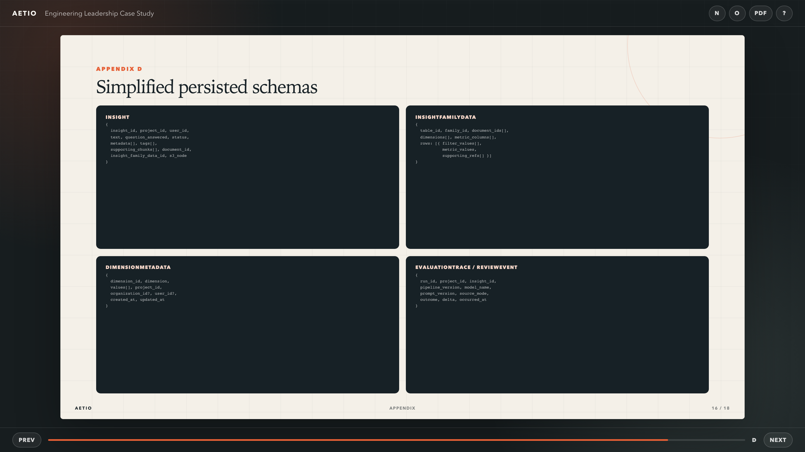

#### 17. Reliability

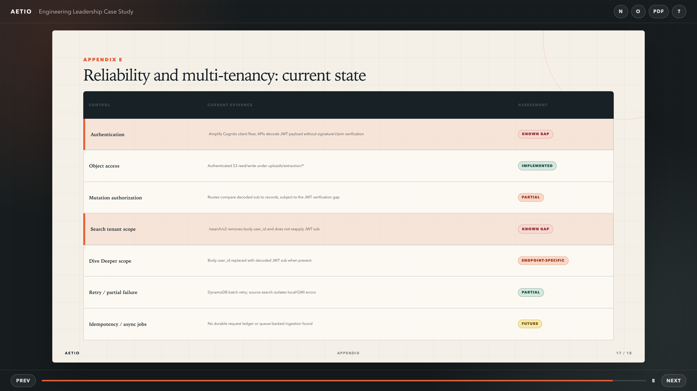

#### 18. Evaluation

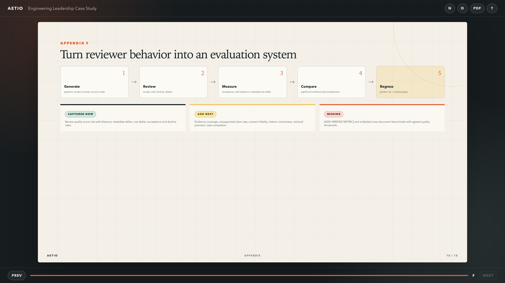

## Navigation

| Key | Action |
| --- | --- |
| `Right`, `Page Down`, `Space` | Next slide |
| `Left`, `Page Up` | Previous slide |
| `Home` / `End` | First / last slide |
| `F` | Toggle browser fullscreen |
| `O` | Toggle slide overview |
| `N` | Toggle the short speaker cue |
| `?` | Show keyboard help |
| `Esc` | Close an overlay |

The current slide is stored in the URL hash, so a slide can be linked directly, for example `#architecture`.

## Speaker Notes

Short cues are available in the deck with `N`. Full narratives, follow-up questions, repository references, and placeholders are in [SPEAKER_NOTES.md](./SPEAKER_NOTES.md).

## Export to PDF

1. Run `npm run dev` or `npm run preview`.
2. Open the deck in Chrome or Edge.
3. Click `PDF` in the deck toolbar or use the browser print command.
4. Choose **Save as PDF**.
5. Use landscape orientation, no margins, background graphics enabled, and a 16:9/custom page size if offered.

The print stylesheet renders every slide as a separate 16:9 page. Speaker cues and navigation controls are excluded.

## Claim Safety

- [REPOSITORY_EVIDENCE.md](./REPOSITORY_EVIDENCE.md) maps major claims to source files.
- [CONTENT_REVIEW.md](./CONTENT_REVIEW.md) lists claims requiring confirmation, missing metrics, and overstatement risks.
- The deck treats the supplied one-pager and PRFAQ as product context, not proof of customer adoption or commercial results.
